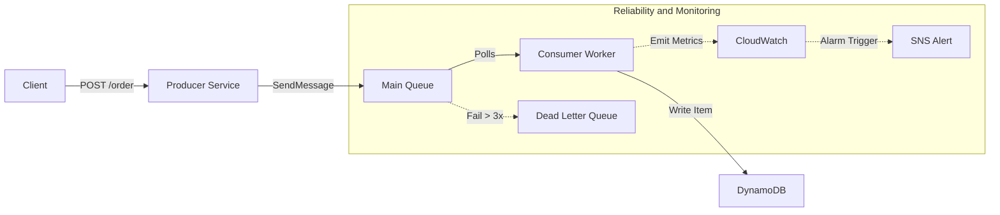

***

# Resilient Event-Driven Order Processing System

   

## 📋 Project Overview

This project demonstrates a robust, **event-driven backend architecture** designed with **Site Reliability Engineering (SRE)** principles. It simulates a high-throughput order processing system that decouples ingestion from processing using asynchronous messaging.

The system is built to handle failures gracefully ("Self-Healing"), ensure data integrity through **idempotency**, and provide deep **observability** via custom metrics and alarms. It is fully deployable locally using **LocalStack** and **Terraform**.

## 🏗 Architecture

The system follows the **Producer-Consumer** pattern with a **Dead Letter Queue (DLQ)** strategy for fault tolerance.



### Key Components
*   **Producer API (Node.js/Express):** Validates requests and offloads them to SQS immediately (Fire-and-Forget).
*   **Message Queue (AWS SQS):** Buffers traffic spikes and decouples services.
*   **Worker Service (Node.js):** Polling consumer that processes orders and handles retry logic.
*   **Database (AWS DynamoDB):** NoSQL store with On-Demand capacity and Point-in-Time Recovery enabled.
*   **Infrastructure as Code (Terraform):** Manages all AWS resources (SQS, DynamoDB, IAM, CloudWatch, SNS).

## 🛡️ SRE & DevOps Features Implemented

| Feature | SRE Concept | Implementation Detail |
| :--- | :--- | :--- |
| **Infrastructure as Code** | Reproducibility | Entire stack provisioned via Terraform with localized provider. |
| **Fault Tolerance** | Resilience | SQS Redrive Policy moves failed messages to a **DLQ** after 3 attempts. |
| **Data Integrity** | Idempotency | Worker uses DynamoDB `attribute_not_exists` to prevent duplicate processing. |
| **Observability** | Monitoring | Custom CloudWatch metrics (`OrdersProcessed`, `OrderFailures`) emitted by the worker. |
| **Alerting** | Incident Response | CloudWatch Alarm triggers an SNS notification if DLQ depth >= 1. |
| **Scalability** | Decoupling | API handles high throughput without waiting for DB writes. |

## 🚀 Getting Started

### Prerequisites
*   **Docker & Docker Compose** (For LocalStack)
*   **Terraform** (v1.0+)
*   **Node.js** (v16+)
*   **AWS CLI** (v2) configured with a dummy profile (`aws configure --profile local`)

### 1. Start Local Infrastructure
Initialize the LocalStack container to emulate AWS services locally.
```bash
docker-compose up -d
```

### 2. Provision Resources (IaC)
Apply the Terraform configuration to create SQS, DynamoDB, IAM Roles, and Alarms.
```bash
cd terraform
terraform init
terraform apply -auto-approve
```

### 3. Start the Microservices
**Terminal A (Producer):**
```bash
cd src/producer
npm install
node index.js
```

**Terminal B (Worker):**
```bash
cd src/worker
npm install
node index.js
```

## 🧪 Testing & Verification

### 1. Happy Path
Send a valid order request:
```bash
curl -X POST http://localhost:3000/order \
     -H "Content-Type: application/json" \
     -d '{"item": "MacBook Pro", "quantity": 1}'
```
*   **Result:** Worker logs `Processing Order...` and saves to DynamoDB.

### 2. Chaos Engineering (Poison Pill)
Simulate a fatal crash to test the DLQ routing.
```bash
curl -X POST http://localhost:3000/order \
     -H "Content-Type: application/json" \
     -d '{"item": "POISON", "quantity": 0}'
```
*   **Result:** Worker crashes 3 times (Simulated). Message moves to DLQ. CloudWatch Alarm state changes to `ALARM`.

### 3. Verify Metrics
Check the custom metrics generated by the worker:
```bash
aws cloudwatch get-metric-statistics \
    --namespace SRE/OrderSystem \
    --metric-name OrdersProcessed \
    --start-time $(date -u -d '1 hour ago' +%Y-%m-%dT%H:%M:%SZ) \
    --end-time $(date -u +%Y-%m-%dT%H:%M:%SZ) \
    --period 3600 --statistics Sum \
    --endpoint-url=http://localhost:4566 --profile local
```

## 📂 Project Structure

```text
.
├── docker-compose.yml       # LocalStack configuration
├── src
│   ├── producer             # Express API (Ingestion Service)
│   │   ├── index.js
│   │   └── .env
│   └── worker               # SQS Consumer (Processing Service)
│       ├── index.js
│       └── .env
└── terraform                # Infrastructure as Code
    ├── provider.tf          # LocalStack provider config
    ├── sqs.tf               # Queues & Redrive Policy
    ├── dynamodb.tf          # Database schema
    ├── cloudwatch.tf        # Alarms
    ├── sns.tf               # Alert topics
    └── iam.tf               # Least Privilege Policies
```

## 🔮 Future Improvements (Roadmap)
*   **Auto-Scaling:** Implement KEDA on Kubernetes to scale workers based on SQS Queue Depth.
*   **Security:** Add API Gateway and Cognito for authentication.
*   **CI/CD:** Add GitHub Actions pipeline for automated Terraform planning and testing.
*   **Tracing:** Implement AWS X-Ray (OpenTelemetry) for distributed tracing.

---